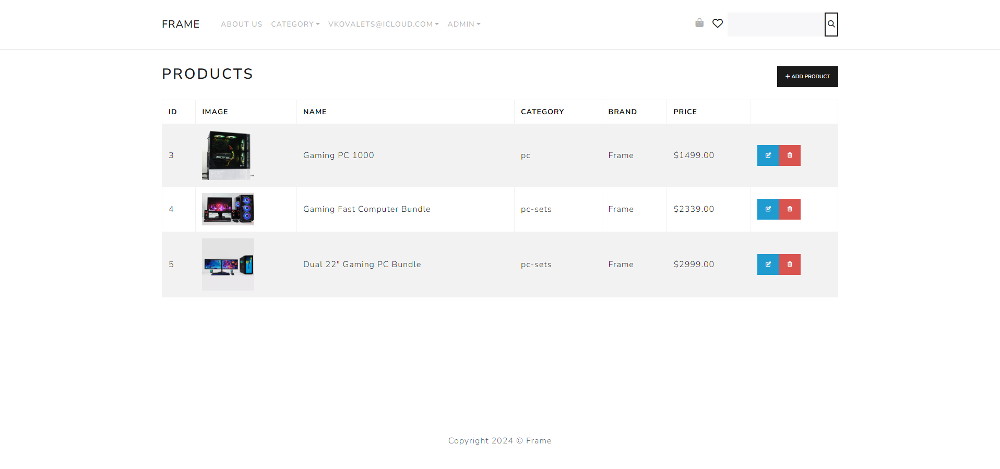
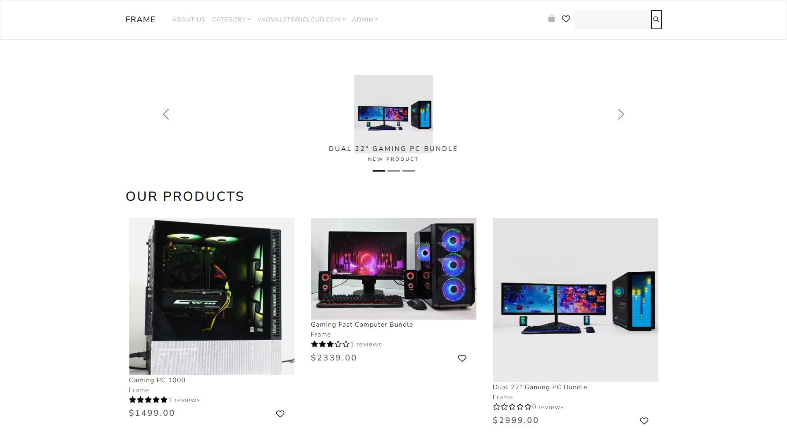
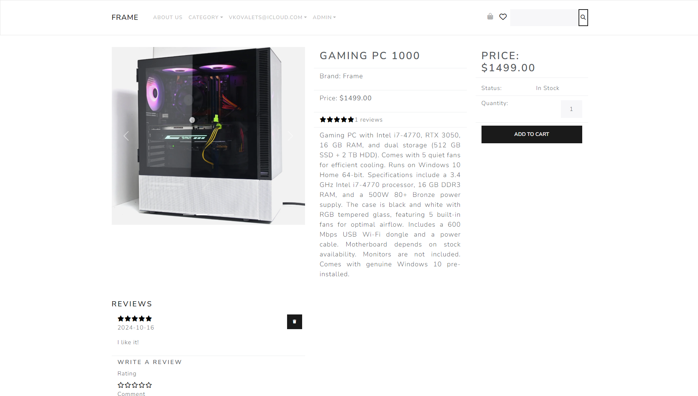
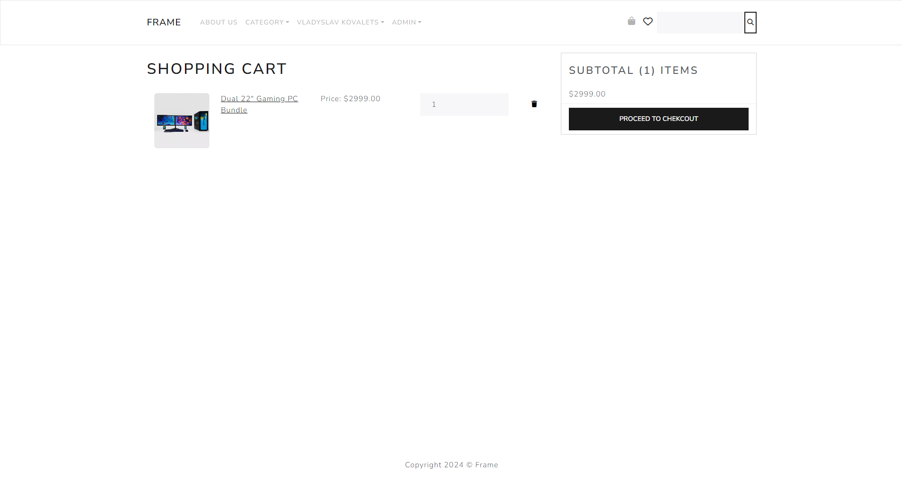
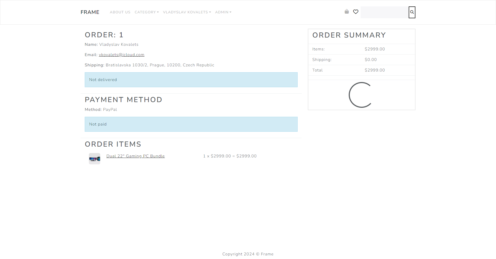

# Full-Stack Application (React & Django)
This is a full-stack web application built with React for the front-end and Django for the back-end. It allows users to browse products, manage a shopping cart, make orders, and for admins to manage products, users, and orders.

